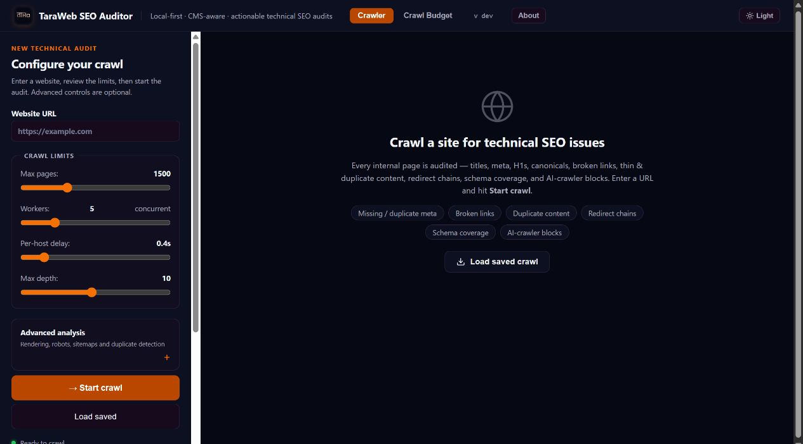
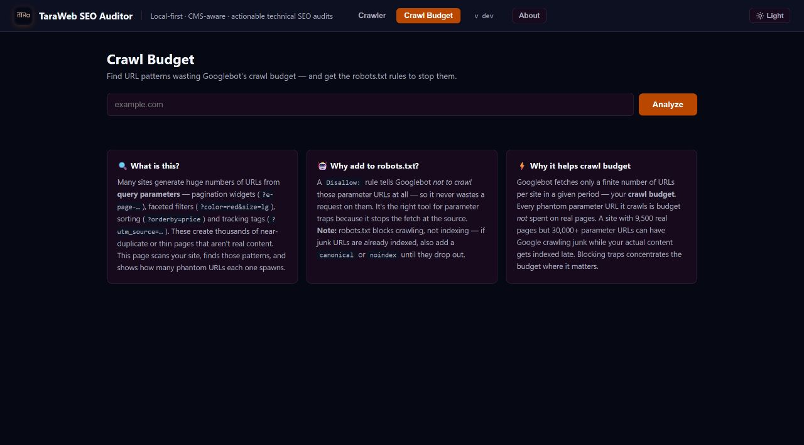

<p align="center">
  <a href="https://taraweb.tech/">
    
  </a>
</p>

<h1 align="center">TaraWeb SEO Auditor</h1>

<p align="center">
  A local-first, open-source crawler for practical technical SEO audits.
</p>

<p align="center">
  <a href="https://taraweb.tech/">TaraWeb</a> ·
  <a href="https://github.com/taraweb-global">GitHub organization</a> ·
  <a href="./SECURITY.md">Security</a> ·
  <a href="./CONTRIBUTING.md">Contributing</a>
</p>

> [!IMPORTANT]
> This project is derived from [Open SEO Crawler](https://github.com/puneetindersingh/open-seo-crawler). Its MIT copyright and permission notice are retained in [LICENSE](./LICENSE), as required by the license. [NOTICE.md](./NOTICE.md) records the upstream attribution and TaraWeb modifications.

## Overview

TaraWeb SEO Auditor crawls a website and turns its technical signals into an actionable browser-based audit. It identifies indexing, metadata, content, linking, accessibility and performance concerns, then lets you filter, save, compare and export the results locally.

The application has no hosted account requirement or telemetry. Crawls and saved reports remain on the operator's machine unless they are deliberately shared.

## Features

- Crawl websites concurrently with configurable page, depth, delay and worker limits.
- Inspect HTTP status codes, response times, redirects and redirect chains.
- Review titles, meta descriptions, headings, canonicals and indexability.
- Analyse robots.txt, XML sitemaps, crawl depth and orphan pages.
- Detect duplicate and near-duplicate page content.
- Inspect structured data, hreflang, Open Graph and Twitter Card metadata.
- Find missing image alternatives, mixed content and common security headers.
- Identify crawl-budget traps, soft-404 patterns and problematic URL parameters.
- Optionally render JavaScript-driven pages with Playwright and Chromium.
- Save crawls locally and compare changes between audit runs.
- Export structured XLSX reports and generated XML sitemaps.
- Use a responsive, keyboard-accessible interface with reduced-motion support.
- Apply local-first protections for CSRF, SSRF, unsafe redirects and oversized responses.

## Screenshots

### Desktop overview



### Crawl-budget analysis



## Demo

**Demo URL:** Not deployed yet.

This tool is designed to run locally. A public demonstration must use an isolated deployment with authentication, strict outbound-network controls and rate limiting; the built-in Flask development server must not be exposed directly to the internet.

## Requirements

- Python 3.10 or newer
- Git
- A modern web browser
- Optional: Playwright and Chromium for JavaScript rendering

## Installation

Clone the public repository and create an isolated Python environment:

```bash
git clone https://github.com/taraweb-global/taraweb-seo-auditor.git
cd taraweb-seo-auditor
python -m venv .venv
```

Activate the environment:

```powershell
# Windows PowerShell
.\.venv\Scripts\Activate.ps1
```

```bash
# macOS or Linux
source .venv/bin/activate
```

Install the production dependencies and start the application:

```bash
python -m pip install --upgrade pip
python -m pip install -r requirements.txt
python app.py
```

Open <http://127.0.0.1:5002/>.

### Optional JavaScript rendering

```bash
python -m pip install "playwright>=1.40,<2"
playwright install chromium
```

Browser rendering executes code supplied by the audited website. Keep Chromium updated and run the auditor as an unprivileged operating-system user.

## Usage

1. Start the application and open <http://127.0.0.1:5002/>.
2. Enter an HTTP or HTTPS website that you own or are authorized to assess.
3. Choose appropriate crawl limits and expand the advanced settings only when needed.
4. Select **Start crawl** and review results as they stream into the interface.
5. Filter issues or open the dedicated sitemap, duplicate-content and crawl-budget reports.
6. Save the crawl to compare it with a future run, or export an XLSX/XML report.

Respect the target's robots.txt rules, terms, capacity and applicable law. Start with conservative concurrency and delay settings on production websites.

## Local development

Install the development toolchain:

```bash
python -m pip install -r requirements-dev.txt
```

Run the application with the same production-safe defaults:

```bash
python app.py
```

Run the verification suite before submitting changes:

```bash
python -m compileall -q app.py challenge_browser.py
pytest -q
bandit -q -r -ll app.py challenge_browser.py
python -m pip_audit -r requirements.txt
python -m pip_audit -r requirements.txt --vulnerability-service osv
```

The optional `test_data_correctness.py` harness uses live websites and Playwright. Run it only with a local application instance and explicit permission to crawl its configured targets.

## Configuration

The application reads environment variables from its process environment. It does not automatically load `.env` files. Copy [.env.example](./.env.example) when your shell or process manager supports dotenv-style configuration, and never commit real credentials.

| Variable | Default | Purpose |
|---|---:|---|
| `TARAWEB_HOST` | `127.0.0.1` | Listening interface. A non-loopback value exposes the application to other devices. |
| `TARAWEB_PORT` | `5002` | Local HTTP port, constrained to the valid port range. |
| `TARAWEB_MAX_REQUEST_BYTES` | `16777216` | Maximum incoming request-body size. |
| `TARAWEB_MAX_FETCH_BYTES` | `10485760` | Maximum downloaded body size for each HTTP response. |
| `TARAWEB_ALLOW_PRIVATE_TARGETS` | `0` | Set to `1` only to audit an intentionally selected private or local target. |
| `TARAWEB_ALLOW_INSECURE_TLS` | `0` | Set to `1` only for an authorized target with a broken or self-signed certificate. |
| `TARAWEB_CSRF_TOKEN` | Generated at startup | Optional fixed request token for managed environments. Treat it as a secret. |
| `SITE_CRAWLER_EXTRA_CRAWL_DIRS` | Unset | Additional read-only crawl directories, separated by `;` on Windows or `:` on macOS/Linux. |
| `SITE_CRAWLER_USER_MAP` | `~/.site-crawler-users.json` | Optional local JSON map from requester IPs to friendly labels. |

Security-sensitive overrides are disabled by default. Do not place TaraWeb production credentials in this project; none are required.

## Architecture

```text
Browser interface
      │ POST controls / SSE crawl results
      ▼
Flask application (app.py)
      ├── input validation, CSRF and response security headers
      ├── concurrent HTTP crawler using policy-enforced sessions
      ├── optional Playwright renderer (challenge_browser.py)
      ├── analysis and report generation
      └── local JSON crawl storage and XLSX/XML exports
```

- `app.py` contains the Flask routes, crawl orchestration, analysis and exports.
- `challenge_browser.py` contains the isolated optional browser-rendering worker.
- `templates/` and `static/` provide the server-rendered shell and client interface.
- `tests/` contains deterministic security and regression coverage.
- `.github/workflows/ci.yml` compiles, tests and audits every proposed change.

The current implementation is intentionally simple and local-first. Splitting the large application module into route, crawl, storage and export packages is a documented future maintainability improvement.

## Security considerations

- The application binds to `127.0.0.1` and has no user-authentication system. Do not expose it directly to a shared network or the public internet.
- Crawl targets and every HTTP redirect are checked against the private, loopback, link-local and reserved-address policy.
- Optional Playwright requests use the same destination policy, but JavaScript rendering still executes untrusted site code in Chromium.
- Response downloads and incoming request bodies are bounded to reduce memory-exhaustion risk.
- Crawler sessions do not inherit ambient proxy or `.netrc` credentials.
- State-changing endpoints require a per-process CSRF token.
- Saved-crawl operations are restricted to regular JSON files inside configured directories.
- Browser-triggered source updates and process restarts are unavailable; updates are explicit terminal operations.
- `.env*`, local crawls, logs, databases, virtual environments and generated installer artifacts are excluded from Git.

DNS resolution and the final socket connection remain separate operations, leaving a residual DNS-rebinding window. The legacy client also uses inline event handlers, so a strict Content Security Policy is not yet enabled. Review the complete threat model and reporting process in [SECURITY.md](./SECURITY.md).

## Contributing

Contributions are welcome through the future public repository under `taraweb-global`.

Before opening a pull request:

1. Read [CONTRIBUTING.md](./CONTRIBUTING.md).
2. Keep changes focused and include tests for behavioral changes.
3. Run the complete local verification suite.
4. Explain security, compatibility and user-facing effects.
5. Never include credentials, private URLs, customer data or sensitive crawl exports.

Security vulnerabilities should be reported privately using the process in [SECURITY.md](./SECURITY.md), not through a public issue.

## About TaraWeb

[TaraWeb](https://taraweb.tech/) builds web, e-commerce and SaaS products for growing businesses through an international delivery model. TaraWeb maintains this project as a practical open-source tool for website quality and technical SEO work.

- Website: [taraweb.tech](https://taraweb.tech/)
- Public GitHub organization: [github.com/taraweb-global](https://github.com/taraweb-global)

## License and attribution

This project is distributed under the MIT License. The upstream copyright and permission notice remain in [LICENSE](./LICENSE), and TaraWeb's modifications are described in [NOTICE.md](./NOTICE.md).

For an exact comparison with the selected upstream baseline, see [docs/UPSTREAM-COMPARISON.md](./docs/UPSTREAM-COMPARISON.md).

Built and maintained by [TaraWeb](https://taraweb.tech/).
